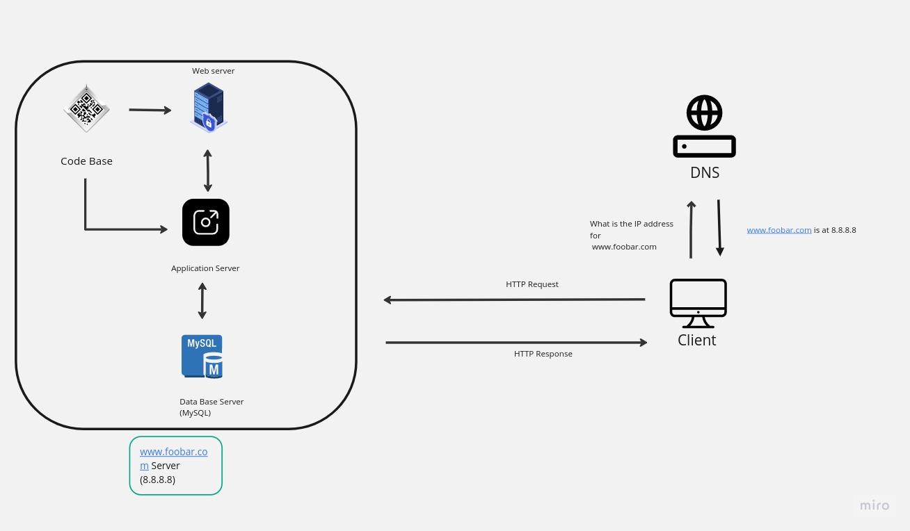

# Simple Web Stack

[Visit Board]https://miro.com/app/board/uXjVMYgf4CY=/?share_link_id=131559261955

## Description

This is a simple web infrastructure that hosts a website that is reachable via `www.foobar.com`.

## Specifics About This Infrastructure

+ What a server is. A server is a computer hardware or software that provides services to other computers, which are usually referred to as *clients*.

+ The role of the domain name. To provide an IP Address. In this case the DNS provides the IP Address 8.8.8.8 for www.foobar.com

+ The type of DNS record `www` is in `www.foobar.com`. `www.foobar.com` uses an **A record**.<i>Address Mapping record (A Record)—also known as a DNS host record, stores a hostname and its corresponding IPv4 address.</i>

+ The role of the web server. The web server is a software/hardware that accepts requests via HTTP or secure HTTP (HTTPS) and responds with the content of the requested resource or an error messsage.

+ The role of the application server. To install, operate and host applications and associated services for end users, IT services and organizations and facilitates the hosting and delivery of high-end consumer or business applications.

+ The role of the database. To maintain a collection of organized information that can easily be accessed, managed and updated

## Issues With This Infrastructure

+ There are multiple SPOF (Single Point Of Failure) in this infrastructure.  If the web server is down the whole system will be down as well.

+ Downtime when maintenance needed. When we need to run some maintenance checks on any component the server will be down thereby affecting service.

+ Cannot scale if there's too much incoming traffic. It would be hard to scale this infrastructure becauses one server and it has no load balancer
