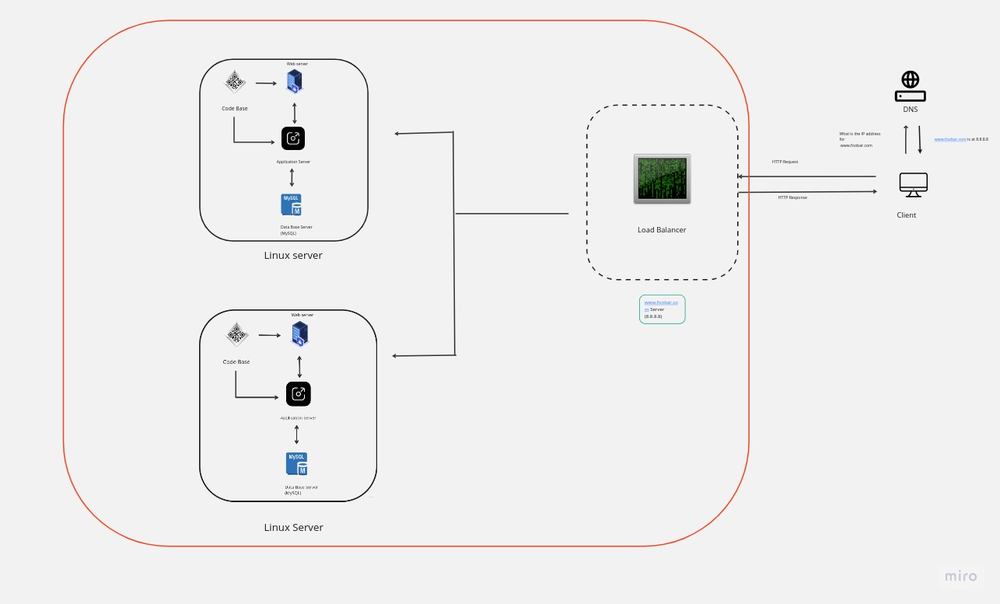

# Distributed Web Infrastructure

[Visit Board](https://miro.com/app/board/uXjVMYCEYjY=/?share_link_id=560567877418)

## Description

This is a distributed web infrastructure that reduces traffic to the primary server by distributing the load to the replica server.

## Specifics About This Infrastructure

+ The distribution algorithm the load balancer is configured with and how it works. The load balancer is configured with the *Least Connections* distribution algorithm. This method passes new connections to the server that has the lease number of connections.
+ The setup enabled by the load-balancer. The load-balancer is enabling an *Active-Passive* setup rather than an *Active-Active* setup. In an *Active-Active* setup, the load balancer distributes workloads across all nodes in order to prevent any single node from getting overloaded. In an *Active-Passive* setup, not all nodes are going to be active. That is, if the first node is active, the second node will be passive or on standby. The passive node will become an active when the preceding node is inactive.
+ How a database *Primary-Replica* (*Master-Slave*) cluster works. A *Primary-Replica* setup configures one server to act as the *Primary* server and the other server to act as a *Replica* of the *Primary* server. However, the *Primary* server is capable of performing read/write requests whilst the *Replica* server is only capable of performing read requests. Data is synchronized between the *Primary* and *Replica* servers whenever the *Primary* server executes a write operation.
+ The difference between the *Primary* node and the *Replica* node in regard to the application. The *Primary* node is responsible for all the write operations the site needs whilst the *Replica* node is capable of processing read operations.

## Issues With This Infrastructure

+ There are multiple SPOF (Single Point Of Failure). For instance, if the Primary database server is down, the entire site would be unable to make changes to the site. If the load balancer becomes inactive the entire site also be down. This is another SPOF.
+ Security issues. The data transmitted over the network isn't encrypted.
+ No monitoring. We have no way of knowing the status of each server.
