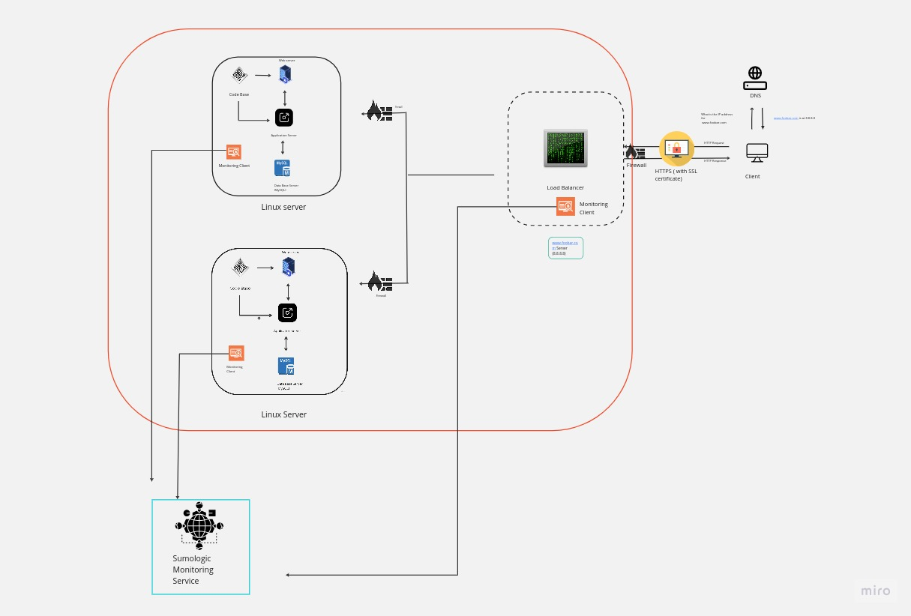

# Secured and Monitored Web Infrastructure

[Visit Board](https://miro.com/app/board/uXjVMYexJ08=/?share_link_id=73545780023)

## Description

This is a 3-server web infrastructure that is secured, monitored, and encrypted.

## Specifics About This Infrastructure

+ The purpose of the firewalls. The firewalls protect the network from unwanted and unauthorized users by acting as an intermediary between the internal network and the external network.
+ The purpose of the SSL certificate. The SSL certificate encrypts traffic between the web servers and  external networks. This helps prevent network sniffers from accessing the valuable information. The SSL ensures privacy, integrity, and identification.
+ The purpose of the monitoring clients. The monitoring clients monitor the servers and the external network. They analyse the performance and operations of the servers, measure the overall health, and alert the administrators if the servers are not performing as expected.

## Issues With This Infrastructure

+ Terminating SSL at the load balancer level would leave the traffic between the load balancer and the web servers unencrypted.
+ Having one MySQL server is an issue because it is not scalable and can act as a single point of failure for the web infrastructure.
+ Having servers with all the same components would make the components compete for resources like CPU, Memory, etc.. which can lead to poor performance. It can also make it difficult to locate the source of an error if it arises. This setup is not easily scalable.
